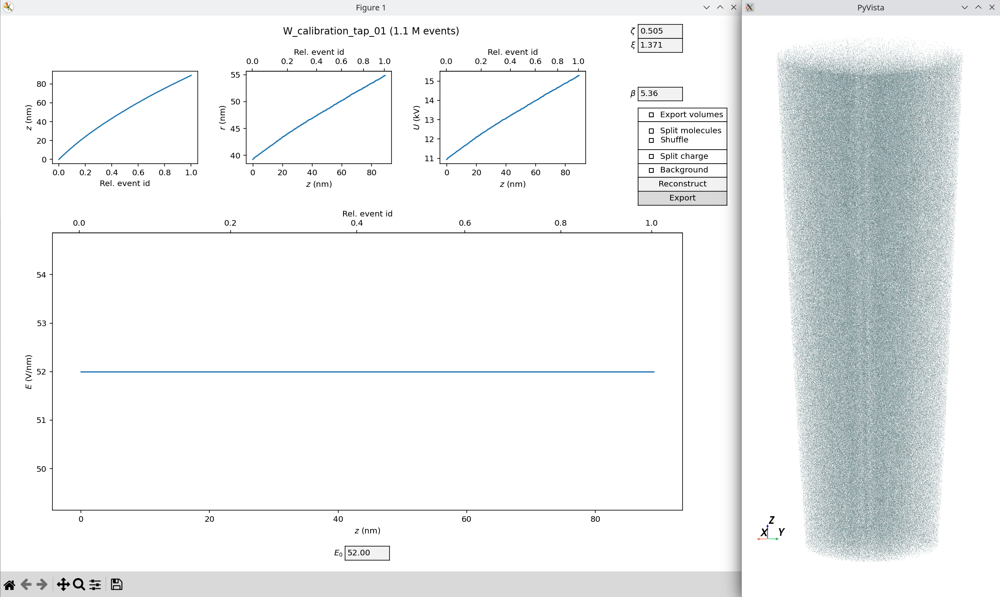
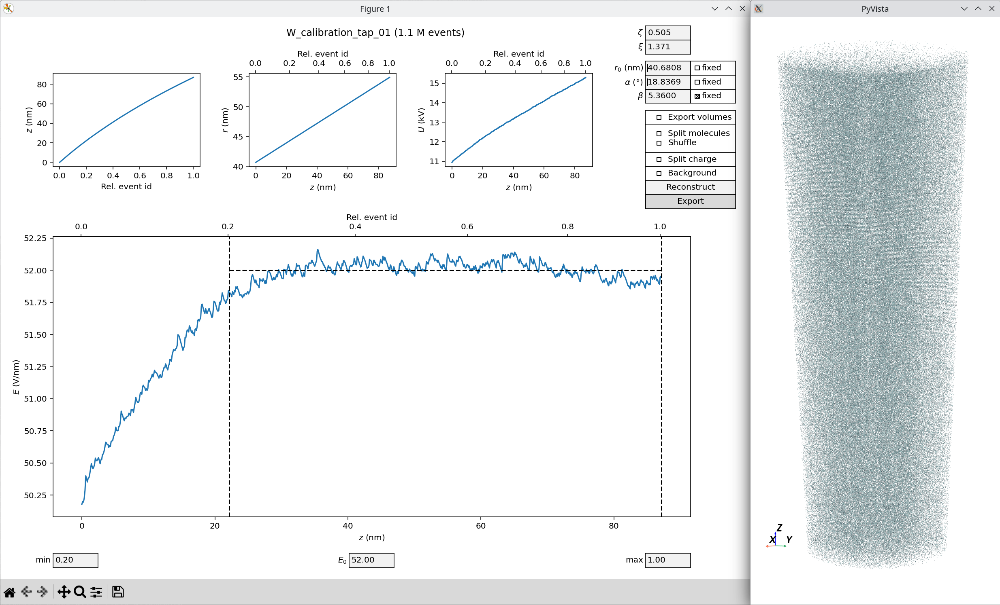

The APyT reconstruction command line script
===========================================

Reconstruction of atom probe data in APyT follows the conventional projection
scheme described by |bas| Two reconstruction modules are available:

1. **Classic scheme** --- The tip radius is derived dynamically from the applied
   voltage.
2. **Taper geometry** --- The tip geometry is predefined by a taper angle and an
   initial radius.

.. note::
   This script performs only the essential three-dimensional reconstruction and
   *basic* visualization. The resulting atomic positions are exported to an
   ASCII text file, which can then be used for further analysis and
   visualization.

Invoking the command line script
--------------------------------

The script ``apyt_reconstruction`` is installed automatically when following the
:doc:`installation instructions<installation>`. It requires a single positional
argument (the measurement ID in the database). Several optional arguments are
also available. For a full list, run:

.. code-block:: bash

   apyt_reconstruction --help

Commonly used options include:

1. ``--no-sql`` --- Skip connecting to an SQL database. Instead, load
   measurement data and metadata from a :doc:`local database<apyt.io.localdb>`.
   This is the typical mode for local testing or standalone workflows.
2. ``--cache`` --- Load measurement data from a binary NumPy ``.npy`` file in
   the working directory. This avoids repeated file parsing or database queries,
   significantly speeding up subsequent runs.

   .. note::

      The cache file is created automatically on the first run and reused for
      subsequent runs on the same measurement ID.

   .. note::

      This option only takes effect when the measurement data is retrieved from
      the SQL database.

3. ``--module <classic|taper>`` --- Choose which reconstruction module to use.
   Defaults to ``taper``.

A typical invocation might look like:

.. code-block:: bash

   apyt_reconstruction --no-sql --module classic 1

Graphical user interface
------------------------

Running ``apyt_reconstruction`` opens a graphical interface for interactive
adjustment of the reconstruction parameters. The examples below show a tungsten
reference measurement reconstructed with both the classic and taper module:

   Reconstruction of a tungsten measurement using the **classic** module.

.. _fig-apyt_cli.reconstruction_taper:

   Reconstruction of a tungsten measurement using the **taper geometry** module.

The graphical interface is divided into three main parts:

1. **Bottom panel** --- Shows the evolution of the evaporation field :math:`E`
   as a function of the tip depth position :math:`z` (bottom axis) and relative
   to the number of reconstructed events (top axis).

   .. note::

      In the classic module, the evaporation field is a constant defined by the
      value in the :math:`E_0` field.

2. **Top row** --- Displays the evolution of tip depth position :math:`z`, tip
   radius :math:`r`, and applied voltage :math:`U`.
3. **Right panel** --- Provides various :ref:`reconstruction parameters
   <apyt_cli.reconstruction:Reconstruction parameters>` and
   :ref:`export options<apyt_cli.reconstruction:Export options>`. The
   **Reconstruct** button triggers the reconstruction, while **Export** writes
   the reconstructed tip positions to an ASCII |xyz_file|. A basic visualization
   of the reconstructed tip is provided via |pyvista| (see figures from above).

Reconstruction parameters
-------------------------

Several free parameters need to be adjusted properly for a correct
reconstruction:

1. :math:`\zeta` --- Detector efficiency.
2. :math:`\xi` --- Image compression factor of the device.
3. :math:`r_0` --- Initial tip radius (only active in
   :ref:`taper geometry<apyt_cli.reconstruction:Taper geometry>`).
4. :math:`\alpha` --- (Full) taper angle (only active in
   :ref:`taper geometry<apyt_cli.reconstruction:Taper geometry>`).
5. :math:`\beta` --- Field factor.

Export options
--------------

Several export options are available for the reconstructed 3D tip positions:

1. **Export volumes** --- Add an additional column to the output file with the
   reconstructed event volumes.
2. **Split molecules / Shuffle** --- Split *molecules* into their constituent
   atoms, all placed at the same position. The **Shuffle** option randomizes the
   order of atoms within each molecule in the output file.
3. **Split charge** --- Export different charge states with different IDs (see
   console output for the chemical mapping to IDs).
4. **Background** --- Also export background atoms (always labeled with ID
   zero).

Taper geometry
--------------

When using the taper geometry module, reconstruction parameter adjustment is
partially automated. If any of the parameters :math:`(r_0, \alpha, \beta)` is
known (e.g. taper angle :math:`\alpha` from specimen preparation), it can be
marked as *fixed* (see
:ref:`corresponding figure<fig-apyt_cli.reconstruction_taper>`). The two
remaining parameters are then automatically adjusted to maintain a constant
evaporation field :math:`E_0` in the bottom panel.

The measurement range for this adjustment can be chosen using the **min** and
**max** fields in the bottom, as indicated by the vertical dashed lines in the
evaporation field plot.

Database upload
---------------

Upon closing the graphical interface, the user is asked whether the final
reconstruction parameters should be uploaded to the database.

.. seealso::

   For further technical details, see the
   :doc:`reconstruction module<apyt.reconstruction.basic>`.

.. |bas| raw:: html

        <a href="https://doi.org/10.1016/0169-4332(94)00561-3"
        target="_blank">Bas et al.</a>

.. |pyvista| raw:: html

        <a href="https://docs.pyvista.org/" target="_blank">PyVista</a>

.. |xyz_file| raw:: html

        <a href="https://en.wikipedia.org/wiki/XYZ_file_format"
        target="_blank">xyz file format</a>

.. sectionauthor:: Sebastian M. Eich <Sebastian.Eich@imw.uni-stuttgart.de>
