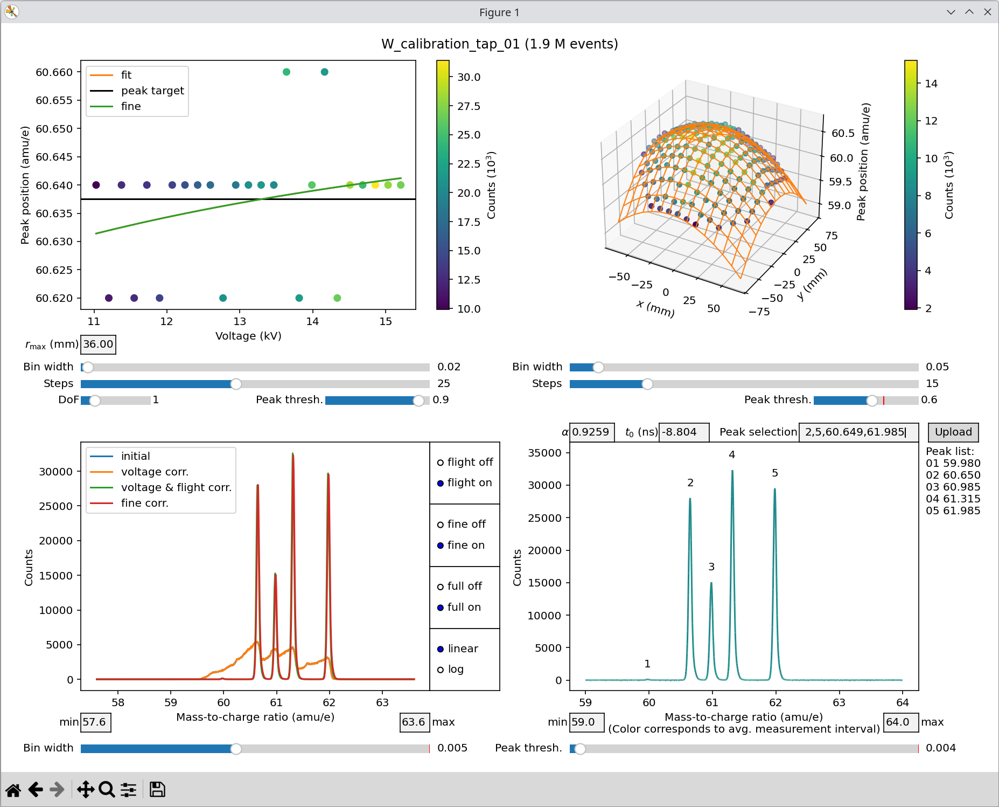

The APyT spectrum alignment command line script
===============================================

The alignment of mass spectra obtained from atom probe measurements follows a
conventional sequence of corrections:

1. **Voltage correction** --- Adjusts peak positions relative to the applied tip
   voltage.
2. **Flight length / hit position correction** --- Corrects peak shifts
   depending on the ion impact position on the detector.
3. **Final alignment** --- Refines the time-of-flight offset :math:`t_0` and the
   nominal tip--detector distance :math:`L_0` to ensure accurate positioning of
   the peaks in the mass spectrum.

.. note::

   The time-of-flight offset :math:`t_0` and tip--detector distance :math:`L_0`
   are intrinsic machine parameters. In a well-calibrated atom probe,
   :math:`t_0` is typically within a few nanoseconds, while :math:`L_0` may vary
   slightly depending on the specimen, its mounting, and the measurement chamber
   setup.

Invoking the command line script
--------------------------------

The script ``apyt_spectrum_align`` is installed automatically when following the
:doc:`installation instructions<installation>`. It requires a single positional
argument (the measurement ID in the database). Additional optional arguments are
available, but defaults usually suffice. For a full list, run:

.. code-block:: bash

   apyt_spectrum_align --help

Three commonly used options are:

1. ``--no-sql`` --- Do not connect to an SQL database. Instead, load measurement
   data and metadata from a :doc:`local database<apyt.io.localdb>`. This is the
   typical mode for testing or local use.

2. ``--cache`` --- Load measurement data from a binary NumPy ``.npy`` file in
   the working directory. This avoids repeated file parsing or database queries
   and speeds up subsequent runs.

   .. note::

      The cache file is created automatically on the first run and reused for
      subsequent runs on the same measurement ID.

   .. note::

      This option only takes effect when the measurement data is retrieved from
      the SQL database.

3. ``--check-voltage`` --- Inspect the voltage evolution during the measurement.
   This option helps verify stable measurement conditions and identify a
   suitable interval for spectral analysis.

A typical invocation might look like:

.. code-block:: bash

   apyt_spectrum_align --no-sql 1

Graphical user interface
------------------------

Running ``apyt_spectrum_align`` opens a graphical interface for interactive
alignment. The example below shows a tungsten reference measurement:

   Exemplary mass spectrum calibration for a tungsten measurement using the
   ``apyt_spectrum_align`` command line script.

The interface is divided into four panels:

1. **Top left** ---
   :ref:`Voltage correction<apyt_cli.spectrum_align:Voltage correction>`
2. **Top right** ---
   :ref:`Hit position correction
   <apyt_cli.spectrum_align:Hit position correction>`
3. **Bottom left** ---
   :ref:`Correction window<apyt_cli.spectrum_align:Correction window>`
4. **Bottom right** ---
   :ref:`Peak position alignment
   <apyt_cli.spectrum_align:Peak position alignment>`

Voltage correction
^^^^^^^^^^^^^^^^^^

Voltage correction compensates for peak drift with applied voltage. The
measurement is divided into voltage segments, and the position of a chosen peak
is tracked. Colors in the plot represent ion counts per segment.

Key sliders (defaults are usually sufficient):

- **r_max** --- Maximum detector radius to include (default: 60%). Hits outside
  this range are ignored.
- **Bin width** --- Vertical axis resolution and granularity of peak detection.
- **Steps** --- Number of voltage segments (horizontal axis).
- **DoF** --- (Internal) degrees of freedom for the correction fit.
- **Peak threshold** --- Relative threshold (default: 90%) to select peaks for
  tracking if multiple candidates exist in the bottom left correction window.
  The *first* candidate above the threshold is used for tracking.

.. tip::

   The **peak threshold** is the most sensitive setting. Lowering it can improve
   consistency when multiple peaks of similar intensity are present.

Peaks are aligned to the black *target line* (weighted average across all
segments). The orange *fit line* describes the fitted drift with voltage.

.. note::

   The effect of the voltage correction is usually minor compared to the
   :ref:`hit position correction
   <apyt_cli.spectrum_align:Hit position correction>`.

Hit position correction
^^^^^^^^^^^^^^^^^^^^^^^

The flight length / hit position correction (top right) accounts for variations
of the peak position across the detector. The available sliders behave similarly
to those in the voltage correction step, but the visualization is
three-dimensional:

- **Bin width** --- Resolution of peak position detection.
- **Steps** --- Number of segments/grid points the detector is divided into
  along the *x* and *y* directions.
- **Peak threshold** --- Relative threshold for peak tracking (see
  :ref:`voltage correction<apyt_cli.spectrum_align:Voltage correction>`).

In most cases, the default values work well. If the orange fit grid closely
matches the data points, the chosen parameters are appropriate.

.. note::

   By definition, no correction is applied at the detector center. Other peak
   positions are internally shifted toward this center during correction.

Correction window
^^^^^^^^^^^^^^^^^

The correction window (bottom left) is centered automatically on the strongest
peak. You can adjust the range manually with the **min** and **max** fields. The
**bin width** slider controls spectral resolution.

Radio buttons toggle features:

- **flight off/on** --- Toggle flight length / hit position correction.
- **fine off/on** --- Toggle
  :ref:`fine correction<apyt_cli.spectrum_align:Fine correction>`.
- **full off/on** --- Toggle full-spectrum plotting (bottom right panel).
- **linear/log** --- Switch between linear and logarithmic scale.

.. note::

   The order of some toggles is mutually exclusive. If you enable or adjust
   certain sliders or fields, other toggles may be automatically disabled by
   design to prevent conflicting settings. You can simply re-enable these
   toggles if required.

This panel overlays spectra at different correction stages:

- **Blue** --- Raw spectrum
- **Orange** --- After voltage correction
- **Green** --- After hit position correction
- **Red** --- After fine correction

Fine correction
^^^^^^^^^^^^^^^

Discretization from above corrections can leave small errors. Fine correction
refines the analytical correction functions to maximize peak sharpness by
optimizing the fitted coefficients (orange line and grid). If these fits are
reasonable, fine correction usually produces the sharpest possible peaks
automatically.

Peak position alignment
^^^^^^^^^^^^^^^^^^^^^^^

The full spectrum (bottom right) is used for final peak alignment. Detected
peaks appear in a list on the right. The **peak threshold** slider determines
which peaks are listed, relative to the strongest peak in the selected range,
defined by the **min** and **max** fields.

Alignment requires two parameters:

- :math:`\alpha` --- Scaling factor for the nominal distance :math:`L_0`
- :math:`t_0` --- Time-of-flight offset

To perform the alignment, select two identified peaks from the list on the right
and provide their exact reference positions in the **peak selection** field as a
comma-separated list. For example, for the tungsten measurement:

.. code-block:: text

   2,5,60.649,61.985

Paste values with ``CTRL+V``. Repeat as needed until the alignment is
satisfactory.

.. attention::

   Always use the **exact isotope mass**. Do not round to integers or fractions
   for higher mass-to-charge states.

.. note::

   Alignment accuracy is limited by the binning width specified in the
   :ref:`correction window<apyt_cli.spectrum_align:Correction window>` and
   should be within :math:`\pm 2` bins.

A correct calibration should yield :math:`\alpha \approx 1` and
:math:`t_0` around a few nanoseconds.

.. attention::

   While manual editing of :math:`\alpha` and :math:`t_0` is possible, automatic
   alignment via the **Peak selection** field is generally recommended. In
   manual mode, **only** the full spectrum plot in the bottom-right panel is
   updated, under the assumption that voltage and hit position corrections are
   independent of the exact values of :math:`\alpha` and :math:`t_0`.

Finally, the **Upload** button saves adjustment parameters to the database.
Upload also occurs automatically when closing the window.

.. seealso::

   For further technical details, see the
   :doc:`spectrum alignment module<apyt.spectrum.align>`.

.. sectionauthor:: Sebastian M. Eich <Sebastian.Eich@imw.uni-stuttgart.de>
