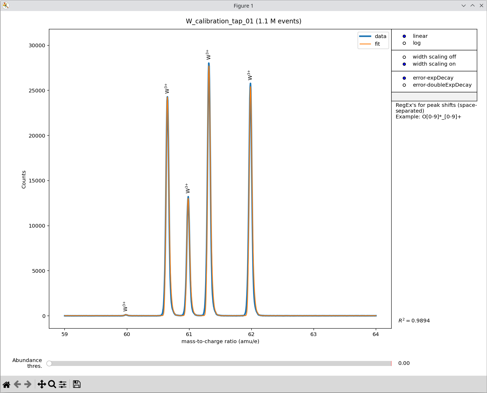

The APyT spectrum fitting command line script
=============================================

The fitting of mass spectra obtained with the ``apyt_spectrum_align`` script is
based on an analytic model describing the generic peak shape. All peaks in the
spectrum are represented using a shared set of peak shape parameters, with only
a single intensity parameter required per isotopic peak group (see also the
:doc:`spectrum fitting module<apyt.spectrum.fit>`). This approach makes
extensive use of the Python |periodictable| module.

.. note::

   A major advantage of this fitting approach is that it supports not only
   individual atoms but also **molecules**. Provided the mass spectrum is
   properly aligned and all species with their respective charge states are
   correctly specified, spectra with more than 100 peaks can typically be fitted
   reliably.

Invoking the command line script
--------------------------------

The script ``apyt_spectrum_fit`` is installed automatically when following the
:doc:`installation instructions<installation>`. It requires two positional
arguments:

1. **Measurement ID** --- the record ID in the database.
2. **Species dictionary** --- a Python dictionary specifying the chemical
   species and charge states present in the spectrum.

To see all available options, run:

.. code-block:: bash

   apyt_spectrum_fit --help

Commonly used options include:

1. ``--no-sql`` --- Skip connecting to an SQL database. Instead, load
   measurement data and metadata from a :doc:`local database<apyt.io.localdb>`.
   This is the typical mode for local testing or standalone workflows.
2. ``--cache`` --- Load measurement data from a binary NumPy ``.npy`` file in
   the working directory. This avoids repeated file parsing or database queries,
   significantly speeding up subsequent runs.

   .. note::

      The cache file is created automatically on the first run and reused for
      subsequent runs on the same measurement ID.

   .. note::

      This option only takes effect when the measurement data is retrieved from
      the SQL database.

The **species dictionary** must be given as a Python-style dictionary string.
Each entry has the following format:

.. code-block:: python

   '<symbol>': ((<charge_states>), <atomic_volume_nm3>)

- ``<symbol>``: chemical symbol (used as key). This can be either an element or
  a **molecule**.
- ``<charge_states>``: tuple of charge states to fit.
- ``<atomic_volume_nm3>``: atomic volume in nm³ (used later in reconstruction).

For example, a tungsten spectrum (only triply charged, volume 0.0158 nm³) can be
provided with:

.. code-block:: bash

   apyt_spectrum_fit --no-sql 1 "{'W': ((3,), 0.0158)}"

.. tip::

   For complex spectra, specifying the properties dictionary directly on the
   command line can be cumbersome. Instead, you can store the dictionary in a
   custom file, e.g. ``my_species.ppy``:

   .. code-block:: python

      {
         'W': ((3,), 0.0158)
      }

   and pass it to the script using:

   .. code-block:: bash

      apyt_spectrum_fit --no-sql 1 "<(cat my_species.ppy)"

   This makes the invocation clearer and easier to maintain.

Graphical user interface
------------------------

Running ``apyt_spectrum_fit`` opens an interactive graphical interface for
spectrum fitting. The example below shows a tungsten reference measurement:

   Exemplary mass spectrum fitting for a tungsten measurement using the
   ``apyt_spectrum_fit`` command line script.

The interface consists of:

- A main panel showing the experimental mass spectrum (blue) and fitted spectrum
  (orange).
- A slider (**Abundance thres.**) at the bottom for controlling automatic peak
  labeling.
- Toggles and input fields on the right-hand side.

The right-hand controls include:

1. **linear/log** --- Toggle between linear and logarithmic scaling of the
   spectrum.
2. **width scaling off/on** --- Enable an additional free fitting parameter that
   scales peak width with mass-to-charge ratio. By default, a square-root
   scaling (exponent = 0.5, as expected physically) is used, but experimental
   data often shows broader peaks.
3. **error-expDecay / error-doubleExpDecay** --- Choose the analytic peak-shape
   function. Both are error-function onsets with one or two exponential
   decays describing peak tailing, respectively.
4. **RegEx's for peak shifts** --- In rare cases, certain species appear
   systematically shifted in the spectrum (e.g., oxygen in oxides). Additional
   shift parameters can be applied to peaks that match a |regular_expression|.

   .. note::

      In the description shown, all pure oxygen peaks (single O atoms or
      O\ :sub:`n` molecules with arbitrary charge state) are shifted together
      using the regular expression ``O[0-9]*_[0-9]+``. The latter part of this
      expression specifies the charge states.

   Multiple regular expressions can be provided, separated by spaces.

   .. attention::

      Use these regular expressions **only** if it is confirmed that certain
      peaks are genuinely shifted in the spectrum. This option should not be
      used to correct or "heal" a misaligned mass spectrum.

5. **RegEx's for peak width scaling** --- In rare cases, certain species may
   exhibit evaporation behavior that differs from the rest of the species in the
   mass spectrum, resulting in peaks with substantially different widths.
   Additional width-scaling parameters can be applied to peaks that match a
   specified |regular_expression|. (See also the details above regarding peak
   shifts.)
6. **R² value** (bottom right) --- Coefficient of determination, a measure of
   the fit quality.

During fitting, additional details on species intensities, abundances, and
composition are reported in the console.

.. seealso::

   For technical details and implementation notes, see the
   :doc:`spectrum fitting module<apyt.spectrum.fit>`.

.. |periodictable| raw:: html

        <a href="https://periodictable.readthedocs.io/en/latest/"
        target="_blank">periodic table</a>

.. |regular_expression| raw:: html

        <a href="https://regexone.com/" target="_blank">regular expression</a>

.. sectionauthor:: Sebastian M. Eich <Sebastian.Eich@imw.uni-stuttgart.de>
