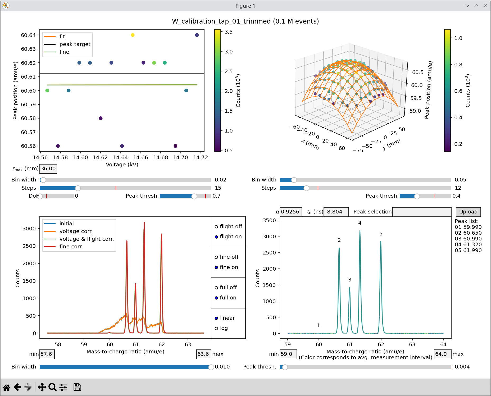

Example usage
=============

.. note::

    Ensure that your Python virtual environment is **activated** before running
    any of the commands below. Otherwise, the executables and dependencies of
    the APyT package may not be found.

If you followed the :doc:`installation instructions<installation>`, a small
exemplary measurement dataset, ``apyt_W_calibration_tap_01_trimmed.raw``, is
automatically installed in your virtual environment. The easiest way to access
this file is to copy it to your current working directory using the following
Python one-liner:

.. code-block:: bash

    python3 -c "from importlib.resources import files; from shutil import copy; copy(files('data').joinpath('apyt_W_calibration_tap_01_trimmed.raw'), '.')"

.. note::

    Before proceeding with this example dataset, it is recommended to first
    familiarize yourself with the
    :doc:`global configuration file <apyt.io.config>` and the structure of the
    :doc:`local database format <apyt.io.localdb>`. It is also recommended to
    read the documentation for the :doc:`command-line interface <apyt_cli>`
    beforehand.

You should then prepare your :doc:`local YAML database <apyt.io.localdb>` file
as shown below, and store it in the location specified in the ``[localdb.file]``
section of the
:ref:`configuration file <apyt.io.config:Default configuration structure>`:

.. code-block:: yaml

    1:
      custom_id: W_calibration_tap_01_trimmed
      device: tap
      file: apyt_W_calibration_tap_01_trimmed.raw
      parameters: {}

Make sure that the ``apyt_W_calibration_tap_01_trimmed.raw`` file you copied to
your working directory is moved to the ``[localdb.data]`` location specified in
the :ref:`configuration file <apyt.io.config:Default configuration structure>`.

.. attention::

    The ``[devices.tap]`` section must be present in your global
    :ref:`configuration file<apyt.io.config:Default configuration structure>`
    for this exemplary measurement.

You can then perform the alignment of the mass spectrum using the
``apyt_spectrum_align`` :doc:`command line script<apyt_cli.spectrum_align>`:

.. code-block:: bash

    apyt_spectrum_align --no-sql 1

.. hint::

    If any setting is misconfigured, you will see a warning or error on the
    command line indicating the exact problem and the expected configuration.

This will load the exemplary measurement file from your local database and open
the graphical interface for spectrum alignment.

.. attention::

    The exemplary dataset contains only 100,000 events, which is significantly
    smaller than a typical measurement. As a result, some APyT automation
    routines may not perform optimally due to higher statistical noise. It is
    intended primarily for testing and familiarization with the workflow.

.. hint::

    The figure below shows a suitable choice for alignment parameters using the
    various text fields and sliders in the graphical interface.

    Spectrum alignment for the exemplary measurement.

.. attention::

    Automatic peak alignment via the **Peak selection** field may not work
    reliably for such a small measurement. You may need to fine-tune the
    alignment by manually adjusting the :math:`\alpha` and :math:`t_0` fields.

Once this step is done, the local database file will be updated and should
contain parameters similar to:

.. code-block:: yaml

    1:
      custom_id: W_calibration_tap_01_trimmed
      device: tap
      file: apyt_W_calibration_tap_01_trimmed.raw
      parameters:
        data_filter:
          detector_radius: 60.0
          mass_charge_range:
          - 59.0
          - 64.0
        spectrum_params:
          L_0: 305.0
          alpha: 0.925599992275238
          bin_width: 0.01
          detector_voltage: 0.0
          flight_coeffs:
          - - 1.0
            - 3.8777146983193234e-05
            - -3.1764066079631448e-06
          - - -6.607927207369357e-05
            - -1.7098403759518987e-07
            - 0.0
          - - -2.7257422061666148e-06
            - 0.0
            - 0.0
          pulse_coupling: 1.0
          t_0: -8.803999900817871
          voltage_coeffs:
          - 2.0708816051483154

You can then proceed with
:doc:`fitting of the mass spectrum<apyt_cli.spectrum_fit>`:

.. code-block:: bash

    apyt_spectrum_fit --no-sql 1 "{'W': ((3,), 0.0158)}"

and finally perform the :doc:`reconstruction<apyt_cli.reconstruction>`:

.. code-block:: bash

    apyt_reconstruction --no-sql --module classic 1

.. attention::

    Confirm updates to your database after every step if requested. Each
    subsequent step relies on the results of the preceding steps.

.. hint::

    The small example dataset is a trimmed version of the dataset demonstrated
    in the :doc:`command line interface<apyt_cli>`. Parameters shown there are
    compatible with this smaller dataset.
